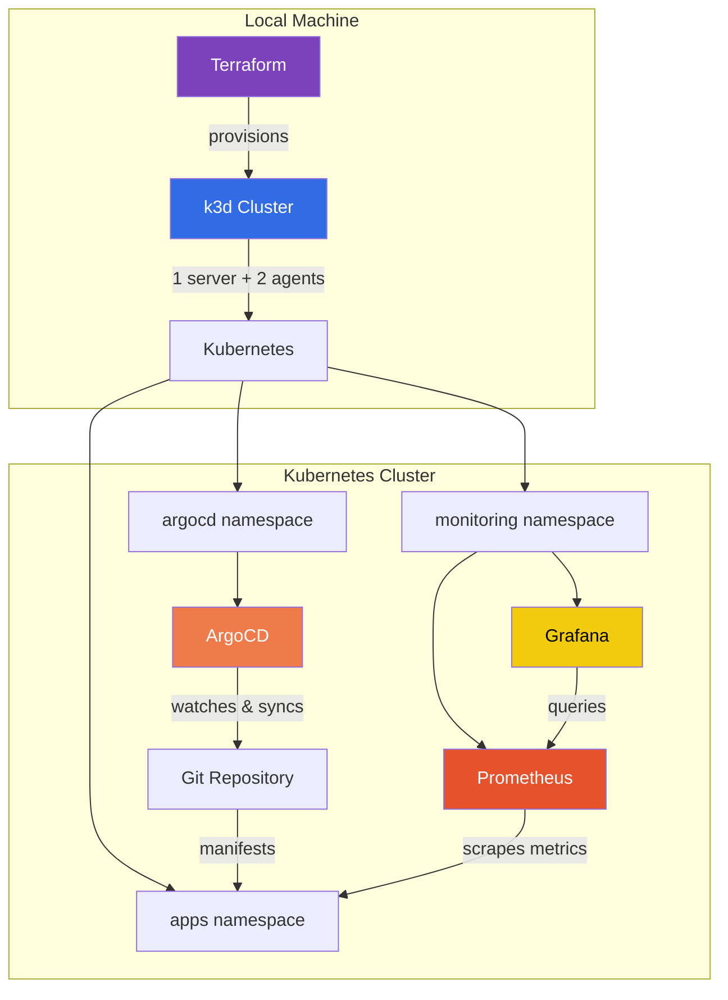

# k8s-gitops-platform

A local Kubernetes GitOps platform built with Terraform, k3d, ArgoCD, Prometheus, and Grafana. Designed as an end-to-end infrastructure-as-code environment where every component — from cluster provisioning to application deployment — is declarative and version-controlled.

## Architecture



## Tech Stack

| Component | Tool | Purpose |
|-----------|------|---------|
| Cluster | [k3d](https://k3d.io/) | Lightweight K8s via k3s-in-Docker |
| IaC | [Terraform](https://www.terraform.io/) | Declarative infrastructure provisioning |
| GitOps | [ArgoCD](https://argo-cd.readthedocs.io/) | Continuous delivery from Git to K8s |
| Metrics | [Prometheus](https://prometheus.io/) | Cluster and application monitoring |
| Dashboards | [Grafana](https://grafana.com/) | Visualization and alerting |
| Ingress | k3d load balancer | Port mapping to host |

## Features

- **One-command setup** — `scripts/setup.sh` provisions the entire platform
- **Infrastructure as Code** — Terraform manages cluster, namespaces, and Helm releases
- **GitOps delivery** — ArgoCD auto-syncs applications from this repository
- **Full observability** — Prometheus + Grafana with kube-prometheus-stack
- **Self-healing** — ArgoCD prune and self-heal enabled on all applications
- **Clean teardown** — `scripts/teardown.sh` destroys everything

## Prerequisites

- [Docker Desktop](https://www.docker.com/products/docker-desktop/)
- [k3d](https://k3d.io/) v5+
- [Terraform](https://www.terraform.io/) v1.0+
- [kubectl](https://kubernetes.io/docs/tasks/tools/)
- [Helm](https://helm.sh/) v3+

```bash
# macOS — install all at once
brew install k3d terraform kubectl helm
```

## Quick Start

```bash
# Clone and provision
git clone https://github.com/kaspitay/k8s-gitops-platform.git
cd k8s-gitops-platform
./scripts/setup.sh

# Access UIs
# ArgoCD:  http://localhost:30080  (admin / <printed by setup>)
# Grafana: http://localhost:30090  (admin / admin)
```

## Project Structure

```
k8s-gitops-platform/
├── terraform/
│   ├── main.tf              # k3d cluster, namespaces, Helm releases
│   ├── variables.tf          # Configurable inputs
│   └── outputs.tf            # Cluster endpoints
├── argocd/
│   └── apps/
│       └── sample-app.yaml   # ArgoCD Application manifest
├── apps/
│   └── sample-app/
│       └── manifests/        # K8s deployment + service
├── monitoring/
│   └── grafana-dashboards/   # Dashboard JSON exports (as-code)
├── scripts/
│   ├── setup.sh              # End-to-end provisioning
│   └── teardown.sh           # Clean destroy
└── .gitignore
```

## GitOps Workflow

1. **Modify** a manifest under `apps/` (e.g., change replica count)
2. **Commit & push** to `main`
3. **ArgoCD detects** the change and syncs the cluster
4. **Prometheus scrapes** the updated workload
5. **Grafana dashboards** reflect the new state

No `kubectl apply` needed — Git is the single source of truth.

## Design Decisions

| Decision | Rationale |
|----------|-----------|
| k3d over minikube/kind | Faster startup, multi-node support, built-in load balancer |
| Terraform over shell scripts | State tracking, idempotent applies, provider ecosystem |
| kube-prometheus-stack | Battle-tested Helm chart bundling Prometheus, Grafana, and alerting rules |
| ArgoCD over Flux | Richer UI for learning and demos, application-centric model |
| NodePort over Ingress | Simpler local access, no ingress controller dependency |

## Teardown

```bash
./scripts/teardown.sh
```

This runs `terraform destroy` which deletes the k3d cluster and all resources.
